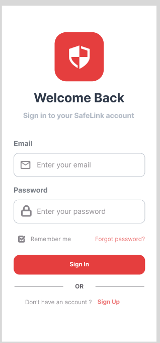
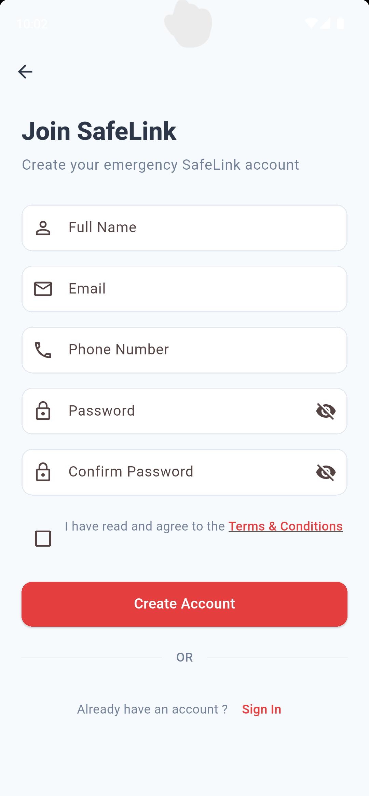
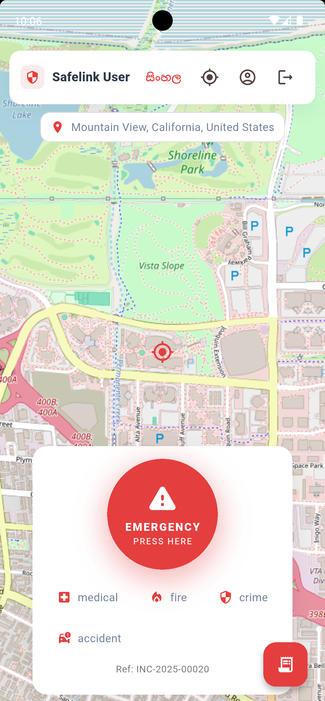
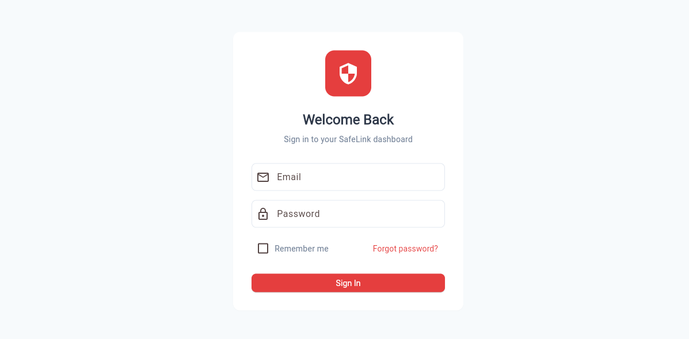
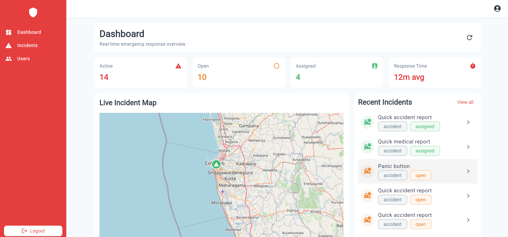

# SafeLink 🚨🛡️

SafeLink is an **emergency response and incident management system** built using **Flutter for both mobile and web interfaces**, with a **Node.js backend**, **MongoDB (local)** as the database, and **machine learning models** (TensorFlow/Keras) for predicting accident severity. This project was developed as part of an academic thesis to integrate emergency response technology with predictive analytics.

---

## 📌 Features

### 👤 User Mobile App (Flutter)

* **Authentication**: Sign up, login, password reset.
* **Emergency Alerts**: One-tap reporting of incidents (Medical, Fire, Crime, Accident).
* **Location Sharing**: Real-time GPS location during emergencies.
* **Account Management**: Register and manage user profiles.

### 🖥️ Web Dashboard (Flutter Web)

* **Incident Management**: Create, assign, resolve, and track incidents.
* **Live Incident Map**: Monitor real-time emergencies.
* **User Management**: Admins can add, remove, or verify users and officers.
* **Analytics Dashboard**: Response times, open/active/assigned incidents.

### 🧠 Machine Learning Integration

* **Accident Severity Prediction** using **EfficientNetV2B2**.
* API-based model integration with backend to prioritize critical emergencies.

---

## 📂 Project Structure

```
safelink/
│
├── client/                 # Flutter mobile app & web dashboard
│   ├── lib/                # Dart source code
│   ├── android/ios/web/    # Platform-specific builds
│   └── ...
│
├── server/                 # Backend (Node.js / Express)
│   ├── API/                # REST API endpoints
│   ├── ServerML/           # ML model integration
│   └── ...
│
├── Model/                  # ML models (TensorFlow/Keras)
│   ├── accident_severity_supervised_mixup_v3/
│   └── Accident Severity Detection.ipynb
│
├── screenshots/            # Screenshots for README
│   ├── app_home.png
│   ├── app_login.png
│   ├── app_register.png
│   ├── web_dashboard.png
│   └── web_login.png
│
├── requirements.txt        # Python dependencies
├── package.json            # Node.js dependencies
├── pubspec.yaml            # Flutter dependencies
└── README.md               # Project documentation
```

---

## 🚀 Installation Guide (Local Setup)

### 1️⃣ Clone the Repository

```bash
git clone https://github.com/Thinura21/safelink.git
cd safelink
```

### 2️⃣ Setup Backend (Node.js + MongoDB)

* Install dependencies:

```bash
cd server
npm install
```

* Ensure **MongoDB** is running locally (default: `mongodb://localhost:27017/safelink`).
* Start backend:

```bash
npm start
```

### 3️⃣ Setup Flutter App (Mobile & Web)

* Install dependencies:

```bash
cd client
flutter pub get
```

* Run for mobile:

```bash
flutter run
```

* Run for web:

```bash
flutter run -d chrome
```

### 4️⃣ Setup Machine Learning Model

* Install Python dependencies:

```bash
cd Model
pip install -r requirements.txt
```

* Start Jupyter Notebook for training/testing:

```bash
jupyter notebook
```

* ML models are exposed via API in `server/ServerML/` for prediction.

---

## 📸 Screenshots

### Mobile App
<p align="center">
  
  
  
</p>

### Web Dashboard
<p align="center">
  
  
</p>
---

## 🔐 Roles & Permissions

* **Admin** – Manage users, monitor incidents, assign officers.
* **Officer** – Handle assigned incidents.
* **User** – Report emergencies.

---

## 🛠️ Tech Stack

* **Frontend (Mobile & Web)**: Flutter (Dart)
* **Backend**: Node.js (Express)
* **Database**: MongoDB (Local)
* **Machine Learning**: TensorFlow, Keras, Python

---

## 📄 Roadmap

* [ ] Push notifications for emergencies
* [ ] Multi-language support
* [ ] Offline reporting support
* [ ] Enhanced predictive analytics

---

## 🤝 Contributing

1. Fork this repo
2. Create a feature branch (`git checkout -b feature-name`)
3. Commit changes (`git commit -m 'Add new feature'`)
4. Push branch (`git push origin feature-name`)
5. Open Pull Request

---

## 📜 License

This project is **unlicensed**. You are free to use, modify, and distribute this project without restriction.
